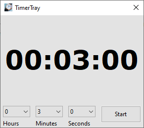
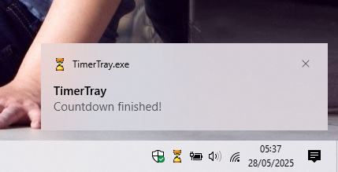

# TimerTray - a simple taskbar countdown timer

This is the latest version of TimerTray, the previous version was written in C# and required the .NET Runtime. This new version is written in C++ using the wxWidgets multi-platform framework. It requires no runtime and Linux and Mac OS X versions will be available in the future.

